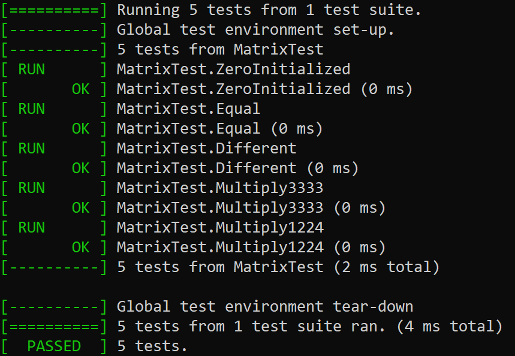

# MatrixTest
Trabalho Prático de Engenharia de Software 2 — Usar GitHub Actions para rodar testes automaticamente.

Escolhi conhecer o [gtest](https://github.com/google/googletest). Referência de como fazer a configuração: https://github.com/bast/gtest-demo

